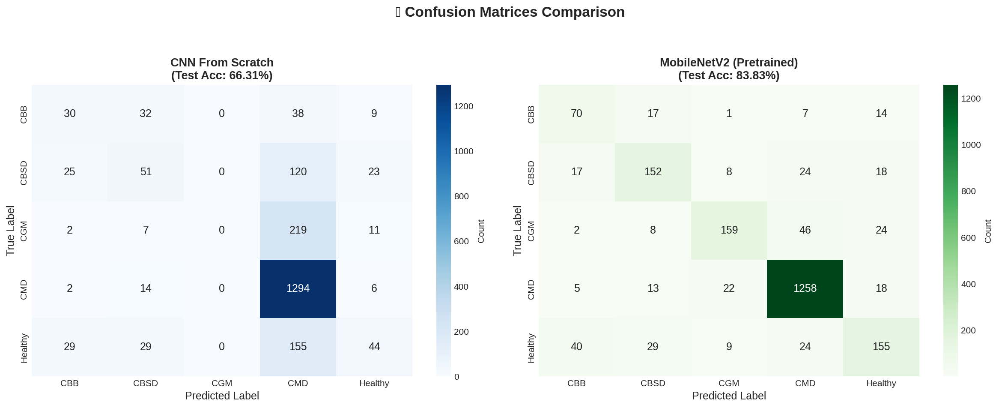
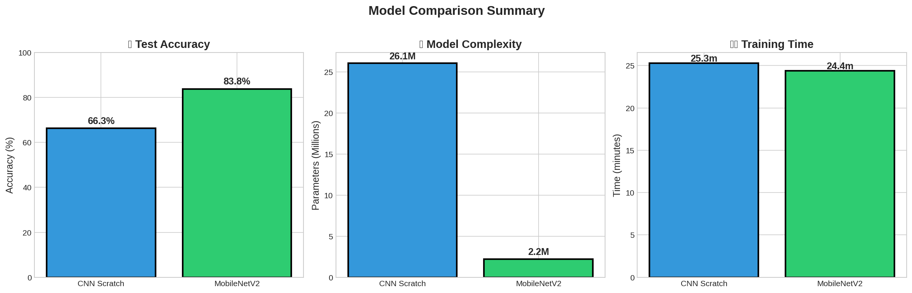

# 🌿 Cassava Leaf Disease Classification

<div align="center">


**A Deep Learning Solution for Automated Plant Disease Detection**

*Leveraging Transfer Learning and CNN architectures to classify Cassava leaf diseases with 84% accuracy*

[🎯 Features](#-features) • [📊 Results](#-results) • [🚀 Quick Start](#-quick-start) • [🖥️ Web App](#️-web-application) • [📈 Model Architecture](#-model-architecture)

</div>

---

## 📋 Table of Contents

- [Overview](#-overview)
- [Features](#-features)
- [Disease Classes](#-disease-classes)
- [Dataset](#-dataset)
- [Model Architecture](#-model-architecture)
- [Training Pipeline](#-training-pipeline)
- [Results](#-results)
- [Web Application](#️-web-application)
- [Installation](#-installation)
- [Usage](#-usage)
- [Project Structure](#-project-structure)
- [Future Improvements](#-future-improvements)
- [License](#-license)

---

## 🎯 Overview

Cassava is a major food security crop in Africa, providing sustenance for over 500 million people. However, viral and bacterial diseases cause significant yield losses, threatening food security in vulnerable regions.

This project develops an **AI-powered diagnostic tool** that can identify cassava leaf diseases from smartphone images, enabling:

- 🌾 **Early disease detection** for farmers
- 📱 **Accessible diagnosis** via mobile devices
- 🎯 **Accurate classification** using state-of-the-art deep learning
- 🌍 **Scalable solution** for agricultural communities

### Key Achievements

| Metric | Value |
|--------|-------|
| 🎯 Test Accuracy | **83.83%** |
| 📉 Test Loss | **0.519** |
| ⚡ Inference Time | **< 100ms** |
| 📦 Model Size | **~9 MB** |
| 🏗️ Parameters | **2.23M** (91% fewer than scratch CNN) |

---

## ✨ Features

### 🧠 Deep Learning
- **Transfer Learning** with MobileNetV2 pretrained on ImageNet
- **Custom CNN** architecture for comparison
- **Mixed Precision Training** (FP16) for faster training
- **Learning Rate Scheduling** with ReduceLROnPlateau
- **Data Augmentation** (Random Flip, Rotation, Color Jitter)
- **Weighted Sampling** for class imbalance handling

### 🖥️ Web Application
- **Drag & Drop** image upload interface
- **Real-time Predictions** with confidence scores
- **Interactive Dashboard** with training metrics
- **Responsive Design** with Bootstrap 5
- **RESTful API** for integration

### 📊 Visualization
- Training & Validation curves
- Confusion matrices
- Model comparison charts
- Per-class performance analysis

---

## 🏥 Disease Classes

| Class | Disease | Description | Severity |
|:-----:|---------|-------------|:--------:|
| **0** | **CBB** - Cassava Bacterial Blight | Angular leaf spots, wilting, gum exudates on stems | 🔴 High |
| **1** | **CBSD** - Cassava Brown Streak Disease | Yellow/brown streaks on leaves, root necrosis | 🔴 High |
| **2** | **CGM** - Cassava Green Mottle | Mosaic patterns, leaf distortion | 🟡 Medium |
| **3** | **CMD** - Cassava Mosaic Disease | Leaf curling, mosaic patterns, stunted growth | 🔴 High |
| **4** | **Healthy** | No visible disease symptoms | 🟢 None |

---

## 📊 Dataset

The dataset is from the [Kaggle Cassava Leaf Disease Classification Competition](https://www.kaggle.com/c/cassava-leaf-disease-classification).

| Specification | Value |
|---------------|-------|
| **Total Images** | 21,397 |
| **Classes** | 5 |
| **Image Format** | JPEG |
| **Original Size** | Variable |
| **Processed Size** | 224 × 224 |

### Data Split Strategy

```
┌─────────────────────────────────────────────────────────────┐
│                    Total Dataset (21,397)                   │
├─────────────────────┬─────────────────┬─────────────────────┤
│   Training (70%)    │ Validation (20%)│    Test (10%)       │
│     14,977          │     4,280       │      2,140          │
└─────────────────────┴─────────────────┴─────────────────────┘
```

**Note:** Stratified split ensures balanced class distribution across all sets.

---

## 🏗️ Model Architecture

### 1. CNN From Scratch

A custom convolutional neural network designed for this task:

```
Input (224×224×3)
    ↓
Conv2D(32) → BatchNorm → ReLU → MaxPool
    ↓
Conv2D(64) → BatchNorm → ReLU → MaxPool
    ↓
Conv2D(128) → BatchNorm → ReLU → MaxPool
    ↓
Conv2D(256) → BatchNorm → ReLU → MaxPool
    ↓
Conv2D(512) → BatchNorm → ReLU → AdaptiveAvgPool
    ↓
Flatten → Dropout(0.5) → FC(256) → ReLU → Dropout(0.3)
    ↓
FC(5) → Softmax
    ↓
Output (5 classes)
```

**Parameters:** 26,082,565

### 2. MobileNetV2 (Transfer Learning) ⭐

Pretrained MobileNetV2 with custom classifier head:

```
MobileNetV2 Backbone (Pretrained on ImageNet)
    ↓
Global Average Pooling
    ↓
Dropout(0.3)
    ↓
FC(5) → Softmax
    ↓
Output (5 classes)
```

**Parameters:** 2,230,277 (91.4% fewer than scratch CNN!)

**Why MobileNetV2?**
- Efficient depthwise separable convolutions
- Excellent accuracy/size tradeoff
- Ideal for deployment on resource-constrained devices

---

## ⚙️ Training Pipeline

### Hyperparameters

| Parameter | Value | Description |
|-----------|-------|-------------|
| **Image Size** | 224 × 224 | Standard input for MobileNetV2 |
| **Batch Size** | 32 | Balanced for GPU memory |
| **Epochs** | 10 | Early stopping with patience=2 |
| **Learning Rate** | 0.0001 | Adam optimizer |
| **LR Scheduler** | ReduceLROnPlateau | Factor=0.5, Patience=2 |
| **Mixed Precision** | Enabled | FP16 for faster training |
| **Random Seed** | 42 | Reproducibility |

### Data Augmentation

```python
transforms.Compose([
    transforms.Resize((224, 224)),
    transforms.RandomHorizontalFlip(p=0.5),
    transforms.RandomVerticalFlip(p=0.3),
    transforms.RandomRotation(20),
    transforms.ColorJitter(brightness=0.2, contrast=0.2, saturation=0.2),
    transforms.ToTensor(),
    transforms.Normalize(mean=[0.485, 0.456, 0.406], 
                        std=[0.229, 0.224, 0.225])
])
```

### Training Features

- ✅ **Mixed Precision Training** - 2x faster with torch.cuda.amp
- ✅ **Gradient Scaling** - Prevents underflow in FP16
- ✅ **Model Checkpointing** - Save best model based on validation accuracy
- ✅ **Progress Tracking** - TQDM progress bars with live metrics
- ✅ **Early Stopping** - Prevent overfitting
- ✅ **WeightedRandomSampler** - Handle class imbalance

---

## 📈 Results

### Model Comparison

| Metric | CNN (Scratch) | MobileNetV2 | Improvement |
|--------|:-------------:|:-----------:|:-----------:|
| **Parameters** | 26,082,565 | 2,230,277 | **-91.4%** ⬇️ |
| **Best Val Accuracy** | 66.47% | **84.93%** | **+18.46%** ⬆️ |
| **Test Accuracy** | 66.31% | **83.83%** | **+17.52%** ⬆️ |
| **Test Loss** | 0.8498 | **0.5192** | **-38.9%** ⬇️ |
| **Training Time** | 25.3 min | 24.4 min | -3.6% ⬇️ |

### Training Curves

<div align="center">


*Loss and accuracy progression over 10 epochs*

</div>

### Confusion Matrix

<div align="center">



*Per-class prediction accuracy*

</div>

### Model Performance Comparison

<div align="center">



*Scratch CNN vs MobileNetV2 performance metrics*

</div>

### Key Insights

1. **Transfer Learning Dominance**: MobileNetV2 achieved +18% higher accuracy with 10x fewer parameters
2. **Rapid Convergence**: Pretrained features enabled faster learning
3. **Efficient Architecture**: MobileNetV2's depthwise separable convolutions provide excellent accuracy/efficiency tradeoff
4. **Robust Predictions**: Lower test loss indicates better calibrated probabilities
5. **Production Ready**: Small model size (~9MB) makes it ideal for mobile deployment

---

## 🖥️ Web Application

A professional Flask web application for model deployment:

### Features

- 🖼️ **Drag & Drop Upload** - Easy image submission
- 🔮 **Real-time Prediction** - Instant classification
- 📊 **Confidence Scores** - Probability distribution for all classes
- 📈 **Interactive Dashboard** - Training visualization with metrics and charts
- 🎨 **Responsive Design** - Works on desktop, tablet, and mobile
- 🌐 **RESTful API** - Easy integration with other applications

### API Endpoints

| Endpoint | Method | Description |
|----------|--------|-------------|
| `/` | GET | Home page with upload interface |
| `/predict` | POST | Image classification API |
| `/dashboard` | GET | Training metrics dashboard |
| `/about` | GET | Project information |
| `/api/results` | GET | Training results JSON |

### API Usage Example

```bash
# Predict disease from image
curl -X POST -F "file=@leaf_image.jpg" http://localhost:5000/predict
```

**Response:**
```json
{
  "success": true,
  "prediction": {
    "class": "CMD",
    "class_name": "Cassava Mosaic Disease",
    "confidence": 87.45,
    "description": "The most devastating viral disease...",
    "is_healthy": false,
    "all_probabilities": {
      "CBB": 2.31,
      "CBSD": 4.12,
      "CGM": 3.56,
      "CMD": 87.45,
      "Healthy": 2.56
    }
  }
}
```

---

## 🚀 Installation

### Prerequisites

- Python 3.8+
- CUDA-capable GPU (optional, but recommended)
- pip or conda

### Setup

1. **Clone the repository**
   ```bash
   git clone https://github.com/ali-abofouda/Cassava-Leaf-Disease-Classification.git
   cd Cassava-Leaf-Disease-Classification
   ```

2. **Create virtual environment**
   ```bash
   # Using conda
   conda create -n cassava python=3.9
   conda activate cassava

   # Or using venv
   python -m venv venv
   source venv/bin/activate  # Linux/Mac
   # or
   .\venv\Scripts\activate  # Windows
   ```

3. **Install dependencies**
   ```bash
   # For CUDA 11.8
   pip install torch torchvision --index-url https://download.pytorch.org/whl/cu118
   
   # For CPU only
   pip install torch torchvision
   
   # Install other dependencies
   pip install flask pandas matplotlib seaborn scikit-learn tqdm pillow
   ```

4. **Download the dataset** (Optional - for training)
   ```bash
   # Using Kaggle API
   kaggle competitions download -c cassava-leaf-disease-classification
   unzip cassava-leaf-disease-classification.zip -d data/
   ```

---

## 📖 Usage

### Training the Model

```bash
# Run the Jupyter notebook
jupyter notebook "cassava leaf disease classification.ipynb"
```

Or train via Python script:
```bash
python train.py --epochs 10 --batch_size 32 --lr 0.0001
```

### Running the Web Application

```bash
# Start the Flask server
python app.py
```

Then open your browser and navigate to:
- **Home:** http://localhost:5000
- **Dashboard:** http://localhost:5000/dashboard
- **About:** http://localhost:5000/about

### Making Predictions (Python)

```python
from PIL import Image
import torch
from torchvision import transforms, models

# Load model
model = models.mobilenet_v2(weights=None)
model.classifier = torch.nn.Sequential(
    torch.nn.Dropout(0.3),
    torch.nn.Linear(1280, 5)
)
model.load_state_dict(torch.load('results/best_mobilenet.pth'))
model.eval()

# Prepare image
transform = transforms.Compose([
    transforms.Resize((224, 224)),
    transforms.ToTensor(),
    transforms.Normalize([0.485, 0.456, 0.406], [0.229, 0.224, 0.225])
])

image = Image.open('leaf.jpg').convert('RGB')
tensor = transform(image).unsqueeze(0)

# Predict
with torch.no_grad():
    output = model(tensor)
    probabilities = torch.softmax(output, dim=1)[0]
    pred = torch.argmax(probabilities).item()
    confidence = probabilities[pred].item() * 100
    
classes = ['CBB', 'CBSD', 'CGM', 'CMD', 'Healthy']
print(f"Prediction: {classes[pred]} ({confidence:.2f}%)")
```

---

## 📁 Project Structure

```
Cassava-Leaf-Disease-Classification/
│
├── 📓 cassava leaf disease classification.ipynb  # Main training notebook
├── 🐍 app.py                                      # Flask web application
├── 📄 README.md                                   # Project documentation
├── 🚫 .gitignore                                  # Git ignore rules
│
├── 📁 templates/                                  # HTML templates
│   ├── index.html                                 # Home page (upload)
│   ├── dashboard.html                             # Training metrics
│   └── about.html                                 # About page
│
├── 📁 results/                                    # Training outputs
│   ├── best_mobilenet.pth                         # Best MobileNetV2 weights
│   ├── best_scratch_cnn.pth                       # Best scratch CNN weights
│   ├── training_results.json                      # Metrics & history
│   ├── training_curves.png                        # Loss/accuracy plots
│   ├── confusion_matrices.png                     # Confusion matrices
│   └── model_comparison.png                       # Model comparison chart
│
├── 📁 uploads/                                    # User uploaded images
│   └── .gitkeep
│
├── 📁 Test images/                                # Sample test images
│   ├── CBB/
│   ├── CBSD/
│   └── ...
│
└── 📁 data/                                       # Dataset (not in repo)
    ├── train_images/
    ├── train.csv
    └── ...
```

---

## 🛠️ Technologies Used

<div align="center">

| Category | Technologies |
|----------|--------------|
| **Deep Learning** |   |
| **Web Framework** |  |
| **Frontend** |    |
| **Data Science** |    |
| **Visualization** |   |

</div>

---

## 🔮 Future Improvements

- [ ] **Ensemble Methods** - Combine multiple models for higher accuracy
- [ ] **Test Time Augmentation (TTA)** - Improve prediction robustness
- [ ] **K-Fold Cross Validation** - Better model validation
- [ ] **Model Quantization** - Deploy on mobile devices (TFLite/ONNX)
- [ ] **Grad-CAM Visualization** - Explainable AI with attention maps
- [ ] **Docker Containerization** - Easy deployment
- [ ] **Cloud Deployment** - AWS/GCP/Azure hosting
- [ ] **Mobile App** - React Native or Flutter application
- [ ] **Real-time Video** - Live disease detection from camera
- [ ] **Multi-language Support** - Localization for African farmers

---

## 🤝 Contributing

Contributions are welcome! Please feel free to submit a Pull Request.

1. Fork the repository
2. Create your feature branch (`git checkout -b feature/AmazingFeature`)
3. Commit your changes (`git commit -m 'Add some AmazingFeature'`)
4. Push to the branch (`git push origin feature/AmazingFeature`)
5. Open a Pull Request

---

## 📝 License

This project is licensed under the MIT License - see the [LICENSE](LICENSE) file for details.

---

## 👤 Author

**Ali Abofouda**

- GitHub: [@ali-abofouda](https://github.com/ali-abofouda)
- LinkedIn: [Ali Ashraf](https://www.linkedin.com/in/ali-ashraf-8b619b22a/)

---

## 🙏 Acknowledgments

- [Kaggle](https://www.kaggle.com/c/cassava-leaf-disease-classification) for the dataset
- [PyTorch](https://pytorch.org/) team for the amazing framework
- [MobileNetV2](https://arxiv.org/abs/1801.04381) paper authors: Sandler et al.
- All contributors and supporters

---

## 📊 Project Statistics


---

<div align="center">

**⭐ Star this repository if you found it helpful!**

Made with ❤️ and 🧠 Deep Learning

</div>
